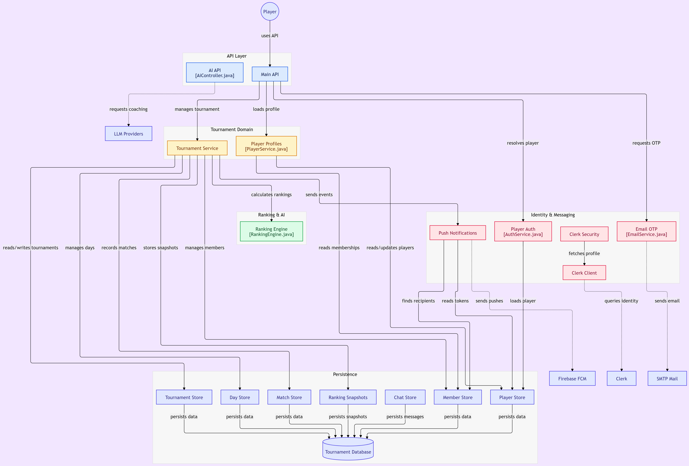

# 🏓 TT Platform
 
A full-stack table tennis tournament management app — session scheduling, live matchmaking, Elo rankings, AI team balancing, real-time chat, and push notifications.
 
- **Backend:** [`tt-backend`](https://github.com/AnmolMahajan-sys/tt-backend) — Spring Boot 3.2.1, Java 17
- **Frontend:** [`tt-frontend`](https://github.com/mahajnanmol2005-design/tt-frontend) — React Native 0.85.3, Expo SDK 56, TypeScript
- **Deployed on:** Render + Koyeb
## Architecture
 

 
Five layers: **API** (main + AI controllers) → **Tournament Domain** (tournament/player services) → **Ranking & AI** (Elo engine) → **Identity & Messaging** (Clerk auth, push, email) → **Persistence** (7 stores, 1 database).
 
## Features
 
- Tournaments with invite codes, admin controls, and 3 match formats (FFA, Balanced Teams, 2v2)
- Live scoring, Elo rankings, streaks, and per-player analytics
- Real-time chat (polls, scheduling, challenges, reactions) over WebSockets
- AI-assisted team balancing and coaching
- Firebase push notifications
- Offline-tolerant client (retry, cache, mutation queue)
## Auth
 
Migrating from self-hosted Spring Security (email/password + OAuth2) to **Clerk**. Backend and frontend code are done; end-to-end device testing is in progress. See `/docs` or commit history for migration details.
 
## Setup
 
**Backend**
```bash
cd tt-backend
./run-local.sh   # needs CLERK_ISSUER + CLERK_SECRET_KEY in .env
```
 
**Frontend**
```bash
cd tt-frontend/TTPlatform
npm install
adb reverse tcp:8081 tcp:8081 && adb reverse tcp:8080 tcp:8080
npx react-native run-android
```
 
## Roadmap
 
- [ ] Finish end-to-end auth test on device
- [ ] Rotate Clerk keys before production
- [ ] Resume tournament-feature work
 
